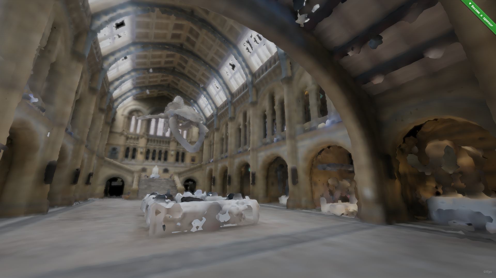

softxels-viewer
==

[](https://softxels-viewer.gatunes.com/)

### Dev environment

```bash
# clone this repo
git clone https://github.com/danielesteban/softxels-viewer.git
cd softxels-viewer
# install dev dependencies
npm install
# start the dev environment:
npm start
# open http://localhost:8080/ in your browser
```

### Build with custom config

By default, it will use [./config.js](./config.js) but you can also use your own:

```js
/* myconfig.js */
export default {
  autoUpdateRenderRadius: false, // Enables loading/unloading of chunks as the camera moves.
  enableDragAndDrop: false, // Enables/Disables Drag & Drop of world files.
  initialWorldURL: false, // URL of a world file to be initially loaded (or false for none).
  renderRadius: 10, // Radius around the camera that chunks are loaded.
  worldMenu: [ // Displays a menu to load worlds
    { name: 'Example', url: 'https://example.com/world.bin' },
  ],
};
```

```bash
# start a dev environment with that config
CONFIG=/path/to/myconfig.js npm run start

# or just build a production bundle with that config
CONFIG=/path/to/myconfig.js npm run build
```
